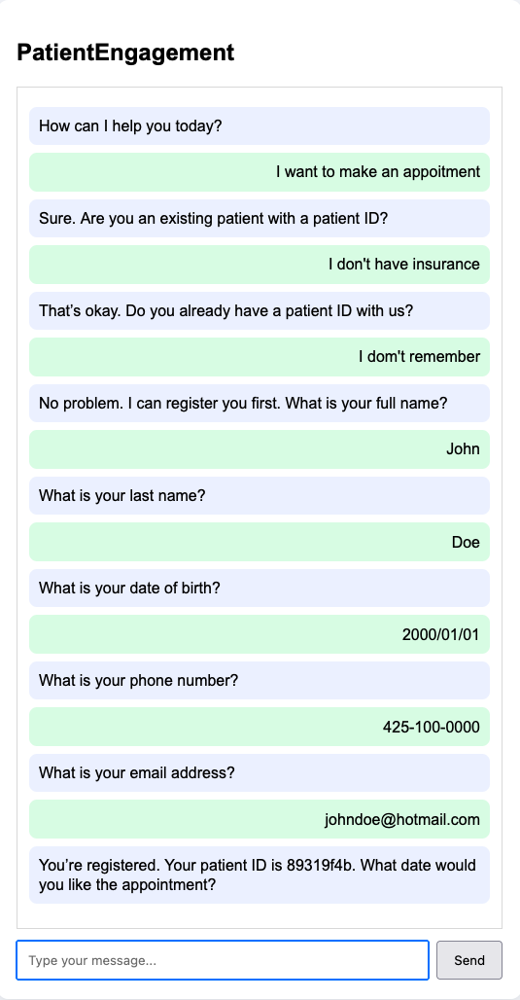

# Patient Engagement MCP Server and Client

A sample healthcare-focused AI application demonstrating the Model Context Protocol (MCP) architecture.

The project includes:

* MCP Servers exposing healthcare-related tools
* MCP Client for communicating with MCP servers
* AI Agent (MCP Host)
* Flask-based web interface
* SQLite database for persistence

## Architecture

```text
User
  │
  ▼
Flask Web UI
  │
  ▼
AI Agent (MCP Host)
  │
  ▼
MCP Client
  │
  ├───────────────┐
  ▼               ▼
Patient MCP     Scheduling MCP
Server          Server
  │               │
  └───────┬───────┘
          ▼
      SQLite DB
```

## Demo Screenshot



## Project Structure

```text
Patient-Engagement-MCP-Server-and-Client/
│
├── README.md
├── requirements.txt
├── .env.example
│
├── app/
│   ├── __init__.py
│   │
│   ├── web/
│   │   ├── __init__.py
│   │   ├── app.py
│   │   ├── templates/
│   │   └── static/
│   │
│   ├── agent/
│   │   ├── __init__.py
│   │   ├── agent.py
│   │   └── prompts.py
│   │
│   ├── client/
│   │   ├── __init__.py
│   │   └── mcp_client.py
│   │
│   ├── servers/
│   │   ├── __init__.py
│   │   ├── mcp_patient_data_server.py
│   │   └── mcp_scheduling_server.py
│   │
│   ├── db/
│   │   ├── __init__.py
│   │   ├── database.py
│   │   └── schema.sql
│   │
│   └── config.py
│
├── data/
│   └── patient_engagement.db
│
└── tests/
    ├── test_patient_server.py
    └── test_scheduling_server.py
```

## Components

### Web UI

Location:

```text
app/web/app.py
```

Responsibilities:

* Accept user questions
* Display AI responses
* Communicate with AI Agent

### AI Agent (MCP Host)

Location:

```text
app/agent/agent.py
```

Responsibilities:

* Interpret user requests
* Select appropriate MCP tools
* Call MCP servers through MCP client
* Generate final responses

### MCP Client

Location:

```text
app/client/mcp_client.py
```

Responsibilities:

* Connect to MCP servers
* Discover tools
* Execute MCP tool calls
* Read MCP context resources

### MCP Context Resources

The MCP servers expose reusable context through resources:

* `context://patient-data/overview`
* `policy://registration/washington-only`
* `policy://registration/adult-only`
* `patient://{patient_id}/context`
* `context://scheduling/overview`
* `appointments://{patient_id}/context`

The AI Agent loads the static context and policy resources during startup so tool selection and final responses can use server-provided context.

### Patient Data MCP Server

Location:

```text
app/servers/mcp_patient_data_server.py
```

Example tools:

* get_patient
* search_patients
* update_patient

### Scheduling MCP Server

Location:

```text
app/servers/mcp_scheduling_server.py
```

Example tools:

* get_appointments
* create_appointment
* cancel_appointment

### Database Layer

Location:

```text
app/db/database.py
```

Responsibilities:

* SQLite connection management
* CRUD operations
* Data persistence

## Installation

Clone repository:

```bash
git clone https://github.com/nguyener/Patient-Engagement-MCP-Server-and-Client.git
cd Patient-Engagement-MCP-Server-and-Client
```

Create virtual environment:

```bash
python -m venv venv
source venv/bin/activate
```

Install dependencies:

```bash
pip install -r requirements.txt
```

## Running the Application

### Start Patient Data MCP Server

From project root:

```bash
python -m app.servers.mcp_patient_data_server
```

### Start Scheduling MCP Server

From project root:

```bash
python -m app.servers.mcp_scheduling_server
```

### Start Web Application

From project root:

```bash
python -m app.web.app
```

Open browser:

```text
http://localhost:5000
```

## Example Questions

Patient Queries:

* Show patient 1001
* Find patient John Smith
* Update patient email

Appointment Queries:

* Show appointments for patient 1001
* Schedule appointment for next Monday
* Cancel appointment 2005

## Technologies

* Python
* Flask
* SQLite
* Model Context Protocol (MCP)
* OpenAI SDK
* HTML/CSS/JavaScript

## Future Enhancements

* Authentication and authorization
* Notification MCP Server
* Email and SMS integration
* FHIR integration
* Oracle Health EHR integration
* Vector search and semantic patient lookup
* Multi-agent orchestration
* LangGraph workflow support
